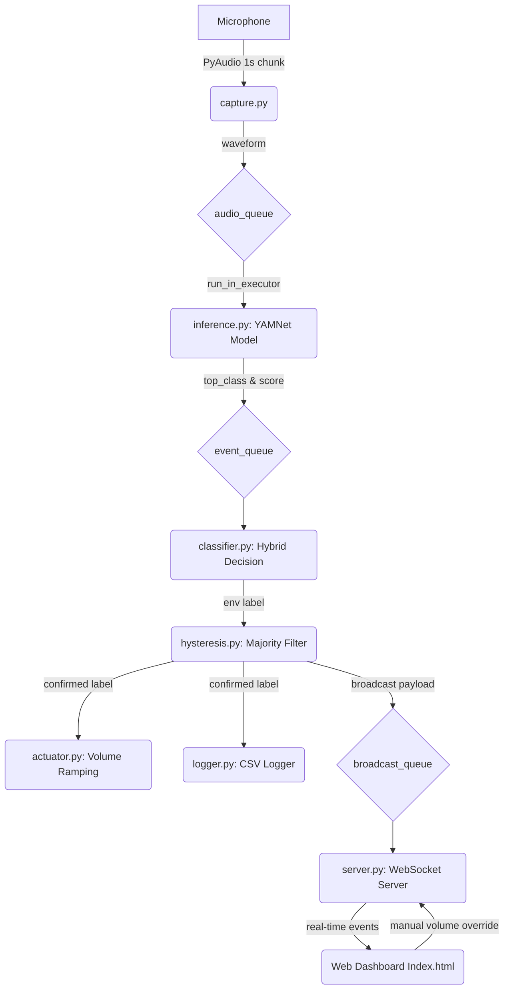

# ACVAS: Ambient Context Volume Adaptation System

ACVAS is an intelligent, real-time volume management system that dynamically adjusts system audio volume based on your environmental noise level. By combining physical audio signal energy (RMS) with deep learning semantic sound classification (Google's YAMNet), ACVAS determines your current context (silent, office, home, crowded) and smoothly ramps the OS master volume to corresponding comfortable levels.

---

## Key Features

- **Hybrid Classification Engine**: Combined analysis of physical audio amplitude (RMS) and neural classification (YAMNet) for accurate environment classification.
- **Hysteresis Smoothing Filter**: Prevents rapid volume fluctuations (fluttering) by requiring a sliding-window majority vote and enforces a minimum hold time (cooldown) between volume changes.
- **Smooth Volume Ramping**: Ramps the system volume incrementally rather than changing it instantly to avoid jarring audio level spikes.
- **Web Dashboard**: Real-time status display and manual override controls using an HTTP file server (port `8766`) and WebSocket broadcasts (port `8765`).
- **Cross-Platform Compatibility**: Fully compatible with Windows (via PyCaw/COM API) and Linux (via `amixer`).

---

## System Architecture



---

## File Structure

```
ACVAS/
├── actuator.py           # Wraps OS volume control (PyCaw for Windows, amixer for Linux)
├── capture.py            # Micro-service capturing 16kHz audio from PyAudio stream
├── classifier.py         # Performs hybrid energy + semantic sound classification
├── config.yaml           # Central parameters, thresholds, and environment configs
├── hysteresis.py         # Sliding-window filter with cooldown times to prevent fluttering
├── inference.py          # TF Hub model loading and execution of Google's YAMNet
├── logger.py             # Logs context transitions to a CSV file (acvas_log.csv)
├── main.py               # Application entry point; wires up event loops and queues
├── requirements.txt      # List of dependencies
├── README.md             # This file
├── server.py             # Spins up background WebSocket and HTTP Dashboard servers
├── test_audio.py         # Diagnostic utility to display audio levels on raw microphone
├── test_capture.py       # Diagnostic utility testing the capture module's queue output
└── static/
    └── index.html        # Front-end dashboard UI with real-time status and overrides
```

---

## Installation

### Prerequisites
- Python 3.10 or higher.
- A functional microphone connected to your machine.

### Setup Steps
1. **Clone the repository**:
   ```bash
   git clone https://github.com/Shivabairy005/ACVAS.git
   cd ACVAS
   ```

2. **Set up a Virtual Environment**:
   ```bash
   python -m venv .venv
   .venv\Scripts\activate      # On Windows
   source .venv/bin/activate    # On Linux/macOS
   ```

3. **Install Dependencies**:
   ```bash
   pip install -r requirements.txt
   ```
   > **Note on Windows**: Make sure Microsoft C++ Build Tools are installed, as compiling PyAudio from source may require it on older wheels.

---

## How to Run

### 1. Diagnostics (Optional but Recommended)
Test that your microphone stream and volume levels are registering correctly before running the full system.

- **Check Raw Input Devices and RMS Levels**:
  ```bash
  python test_audio.py
  ```
  *This will print your system audio input devices and show a real-time RMS meter.*

- **Verify Audio Queue Capture**:
  ```bash
  python test_capture.py
  ```
  *This ensures the 1-second chunks are correctly loaded and normalized in the capture queue.*

### 2. Launch the System
```bash
python main.py
```
Upon startup, the system will:
1. Print diagnostic details.
2. Initialize and load YAMNet (~20MB download on first run; cached subsequently).
3. Open the audio capture device.
4. Host the Web Dashboard at `http://localhost:8766` and WebSocket server at `ws://localhost:8765`.

Open `http://localhost:8766` in your web browser to monitor the real-time classification changes and manually override volume levels.

---

## Configuration (`config.yaml`)

The system's behavior can be fully customized by editing `config.yaml`. The key parameters include:

- `sample_rate`: Sample rate of captured audio (YAMNet expects `16000`).
- `chunk_duration_sec`: Inference window length (typically `1` second).
- `ws_port` / `http_port`: Ports for WebSocket notifications and HTTP server.
- `hysteresis_frames` / `hysteresis_majority`: Window parameters. e.g. at `5` frames and majority of `3`, the same environment must occupy 3 out of 5 frames to trigger a change.
- `min_hold_seconds`: Cooldown time (default `3` seconds) before a new change is processed.
- `rms_silent_threshold`: Physical noise level below which the room is classed as `silent` (default `0.001`).
- `rms_crowded_threshold`: Physical noise level above which the room is classed as `crowded` (default `0.03`).
- `environments`: A list mapping environment classes (`silent`, `office`, `home`, `crowded`) to their target volume levels (`volume` from `0.0` to `1.0`) and YAMNet class index indices.
